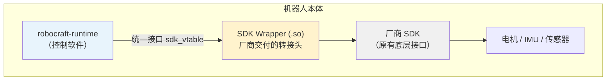
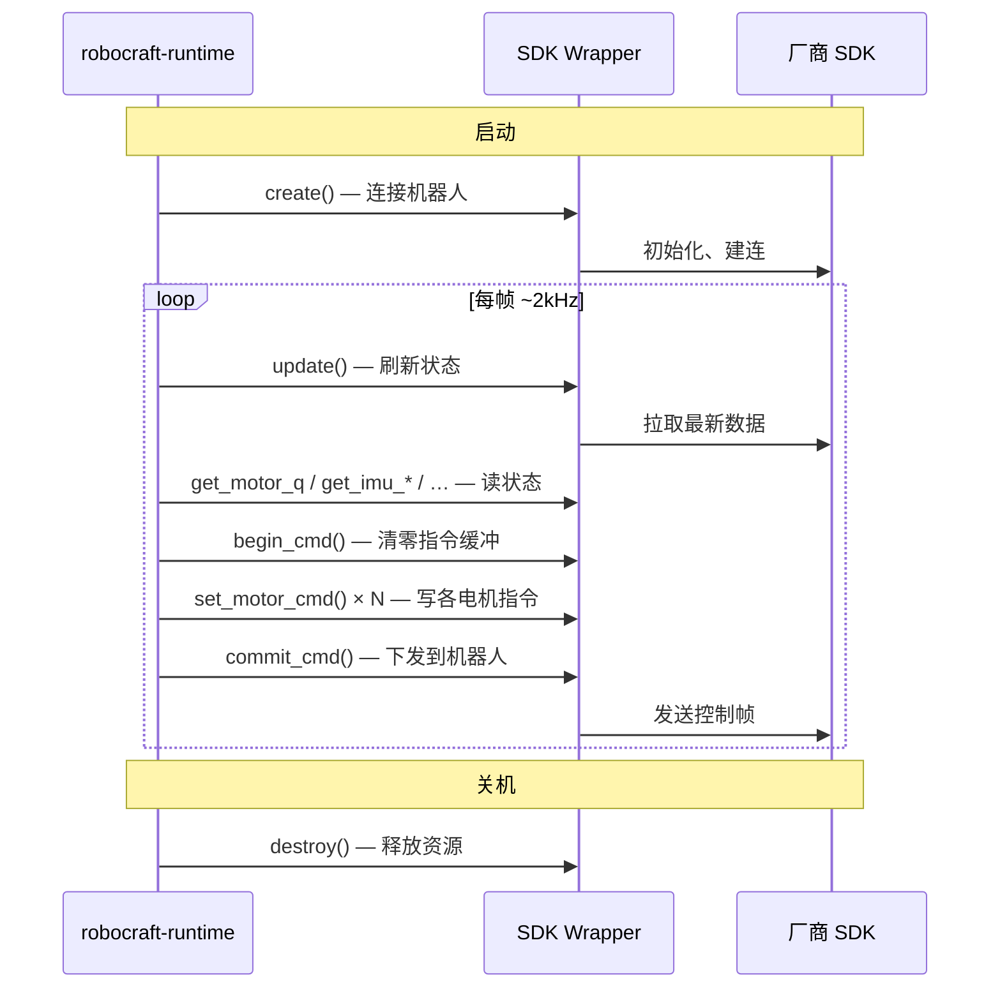
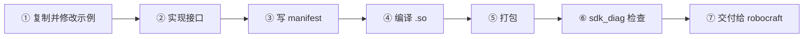

# 1. robocraft SDK Wrapper 适配套件

> **给第一次接触这个项目的读者：** 若您还不清楚「wrapper」「vtable」「runtime」分别是什么，直接从下面的 [1.1. 这个项目在做什么？](#11-这个项目在做什么) 读起即可。本文尽量用白话说明；需要查规范细节时，再去看 [适配手册](docs/vendor-api-manual-v1.0.md)。  
> **分步动手教程（GitHub Pages）：** [Unitree G1 SDK2 指南](https://bridgedp-robotics.github.io/robocraft-sdk/guides/unitree-g1.html) · [Unitree G1 ROS 2 RMW 指南](https://bridgedp-robotics.github.io/robocraft-sdk/guides/unitree-g1-rmw.html)

- [1. robocraft SDK Wrapper 适配套件](#1-robocraft-sdk-wrapper-适配套件)
  - [1.1. 这个项目在做什么？](#11-这个项目在做什么)
  - [1.2. 整体架构](#12-整体架构)
  - [1.3. 运行时每一帧在干什么？](#13-运行时每一帧在干什么)
  - [1.4. 谁应该读这份文档？](#14-谁应该读这份文档)
  - [1.5. 先搞懂这几个词](#15-先搞懂这几个词)
  - [1.6. 选哪个示例当起点？](#16-选哪个示例当起点)
  - [1.7. 接入流程（7 步）](#17-接入流程7-步)
    - [1.7.1. ① 复制并修改示例](#171-①-复制并修改示例)
    - [1.7.2. ② 实现 sdk_vtable（核心工作）](#172-②-实现-sdk_vtable核心工作)
    - [1.7.3. ③ 写 manifest 与 ci 配置](#173-③-写-manifest-与-ci-配置)
    - [1.7.4. ④ 编译](#174-④-编译)
    - [1.7.5. ⑤ 打包](#175-⑤-打包)
    - [1.7.6. ⑥ 自检与上机冒烟](#176-⑥-自检与上机冒烟)
    - [1.7.7. ⑦ 交付](#177-⑦-交付)
  - [1.8. 仓库目录一览](#18-仓库目录一览)
  - [1.9. 构建参考示例（宇树 G1）](#19-构建参考示例宇树-g1)
  - [1.10. 常见问题](#110-常见问题)
  - [1.11. 进一步阅读](#111-进一步阅读)

---

## 1.1. 这个项目在做什么？

**一句话：** 帮机器人厂商把自己的机器人，接到 **robocraft** 控制平台上。

拆开来说：

1. **robocraft-runtime** 是一套跑在机器人身上的控制软件（走路、平衡、遥控等）。
2. 每家机器人的底层 SDK 都不一样——接口、通信方式、数据结构各不相同。
3. 本项目提供一套**统一标准**（接口定义 + 文档 + 示例代码 + 自检工具），让厂商把自家 SDK **包一层**，做成一个叫 **wrapper** 的 `.so` 文件。
4. runtime 加载这个 `.so` 后，就能用**同一套方式**读关节、读 IMU、发控制指令——不用为每台机器人重写整套上层逻辑。

**生活化类比：** 像手机充电器的**转接头**。手机（robocraft）只认一种标准接口；各国插座（各家机器人 SDK）形状不同。厂商做的 wrapper 就是转接头——一头接自家机器人，一头露出统一接口。本仓库 = **转接头的规格书 + 样品（宇树 G1 示例）+ 检测工具**。

**您的交付物是什么？** 一个压缩包（`sdk-<机型>-<架构>.tar.gz`），里面主要是：

- `lib<name>_wrapper.so` — 您编写的转接头
- `manifest.yaml` — 机型、版本、能力声明
- `checksums.sha256` — 文件校验和
- `lib/`（可选）— 需要随包带走的依赖库

**您不需要做什么？** runtime 内部的控制器、状态机、平台对接都由 robocraft 实现。厂商只负责做好 wrapper 并交付。

---

## 1.2. 整体架构



runtime 在**独立子进程**里加载 wrapper（`dlopen`），与主进程内存隔离。因此：除少数系统库外，依赖库应**自带进包**，通过 `RPATH=$ORIGIN/lib` 找到，不能指望 `LD_LIBRARY_PATH`。

---

## 1.3. 运行时每一帧在干什么？

wrapper 被加载后，runtime 大约以 **2 kHz** 循环调用 wrapper 中实现的函数：



---

## 1.4. 谁应该读这份文档？

| 角色 | 需要做的事 |
| ------ | ------------- |
| 机器人厂商工程师 | 按本文流程实现 wrapper，打包交付 |
| 集成 / 测试工程师 | 用 `sdk_diag` 做静态检查与上机冒烟 |
| 已熟悉 ABI 的开发者 | 查 [适配手册](docs/vendor-api-manual-v1.0.md) 与 [接口头文件](sdk_wrapper/interface/sdk_wrapper_interface.h) |

---

## 1.5. 先搞懂这几个词

| 术语 | 白话解释 |
| ------ | ---------- |
| **runtime** | 跑在机器人上的 robocraft 控制程序 |
| **wrapper** | 厂商编写的 `.so`，把自家 SDK 翻译成统一接口 |
| **sdk_vtable** | wrapper 对外暴露的**唯一**函数表；runtime 只认它 |
| **vendor SDK** | 厂商原有的机器人 SDK（未改动的底层那一层） |
| **manifest.yaml** | 包的「身份证」：机型、版本、能力、依赖声明 |
| **capabilities** | 能力清单：有没有 IMU、摇杆、低层控制等 |
| **sdk_diag** | 自检工具：检查包是否合规 + 上真机联调 |

---

## 1.6. 选哪个示例当起点？

仓库里有两个可参考的宇树 G1 示例，请**复制并修改**最接近您集成方式的那个：

| 目录 | 适合场景 | 通信方式 |
| ------ | ---------- | ---------- |
| [`sdk_wrapper/unitree_g1/`](sdk_wrapper/unitree_g1/) | 直接链接厂商静态库，依赖自己打进包 | 自带 Cyclone DDS |
| [`sdk_wrapper/unitree_g1_rmw/`](sdk_wrapper/unitree_g1_rmw/) | 机器人上已有 ROS 2，走话题通信 | ROS 2 + RMW（默认 Cyclone DDS） |

**分步教程（GitHub Pages）：** [G1 SDK2 指南](https://bridgedp-robotics.github.io/robocraft-sdk/guides/unitree-g1.html) · [G1 RMW 指南](https://bridgedp-robotics.github.io/robocraft-sdk/guides/unitree-g1-rmw.html)

> **RMW** = ROS Middleware（ROS 2 中间件接口）。`unitree_g1_rmw` 即「通过 ROS 2 话题（如 `/lowstate`、`/lowcmd`）与 G1 通信」的 wrapper 版本。

复制示例后，将目录改成您的机型名（下文以 `my_robot` 为例）。

---

## 1.7. 接入流程（7 步）



### 1.7.1. ① 复制并修改示例

```bash
cp -r sdk_wrapper/unitree_g1 sdk_wrapper/my_robot
# 或：cp -r sdk_wrapper/unitree_g1_rmw sdk_wrapper/my_robot
```

随后按机型重命名文件、修改 `CMakeLists.txt`、`manifest.yaml` 等配置（详见后续步骤）。

### 1.7.2. ② 实现 sdk_vtable（核心工作）

在 wrapper 里调用**厂商 SDK**，填好函数表并导出。`.so` **只对外暴露一个符号** `sdk_vtable`：

```cpp
SDK_API extern const sdk_vtable_t sdk_vtable = {
    sizeof(sdk_vtable_t), SDK_API_VERSION,
    VCreate, VDestroy, VGetNumMotors, /* ... */
};
```

下面 **9 个函数是必填的**，缺任何一个 runtime 都会拒绝加载：

| 函数 | 需要完成的事 |
| ------ | ------------ |
| `create` | 连接机器人 SDK；从 `wrapper_dir/config.json` 读配置 |
| `destroy` | 断开连接、释放资源 |
| `get_num_motors` | 返回电机数量 |
| `update` | 每帧刷新内部状态（非阻塞，尽量 < 1 ms） |
| `get_motor_q` | 读关节位置 |
| `get_motor_dq` | 读关节速度 |
| `begin_cmd` | 清零本帧指令缓冲 |
| `set_motor_cmd` | 给指定电机写 q / dq / tau / kp / kd |
| `commit_cmd` | 把本帧指令发给机器人 |

有 IMU、摇杆、电池、控制权切换等能力时，继续实现对应函数，并在 `get_capabilities` 与 `manifest.yaml` 里**如实声明**。

> 接口权威定义见 [`sdk_wrapper_interface.h`](sdk_wrapper/interface/sdk_wrapper_interface.h)。

### 1.7.3. ③ 写 manifest 与 ci 配置

参照示例修改 `sdk_wrapper/my_robot/manifest.yaml` 和 `ci.yaml`：

- `api.entrypoint` → 对应的 `.so` 文件名
- `api.capabilities` → 与代码实现一致
- `private_libs` → 需要随包带走的依赖库列表

### 1.7.4. ④ 编译

参照示例的 `CMakeLists.txt` 配置（隐藏符号、只导出 `sdk_vtable`、`RPATH=$ORIGIN/lib`）：

```bash
cmake -S sdk_wrapper/my_robot -B build/my_robot
cmake --build build/my_robot
# 产物：build/my_robot/libmy_robot_wrapper.so
```

**开始前确认三件事：**

- 目标架构：`aarch64` 或 `x86_64`（须与机器人 CPU 一致）
- glibc 版本：编译环境不能比机器人上的 glibc **更新**
- 非系统依赖（DDS、SSL 等）须打进包的 `lib/` 目录

### 1.7.5. ⑤ 打包

```bash
ARCH=$(uname -m)

mkdir -p build/intermediates
cp build/my_robot/libmy_robot_wrapper.so build/intermediates/
ci/package_sdk.sh my_robot $ARCH
# → sdk-my-robot-$ARCH.tar.gz
```

包内结构示意：

```bash
sdk-my-robot-aarch64.tar.gz
├── manifest.yaml
├── libmy_robot_wrapper.so    ← 在包根目录
├── checksums.sha256
└── lib/                      ← 可选，私有依赖
    └── libxxx.so
```

### 1.7.6. ⑥ 自检与上机冒烟

先构建诊断工具（只需一次）：

```bash
cmake -S tools/sdk_diag -B build-sdk_diag && cmake --build build-sdk_diag
```

**静态检查**（符号、RPATH、依赖、包结构、校验和）：

```bash
build-sdk_diag/sdk_diag --check sdk-my-robot-$ARCH.tar.gz
```

**上真机联调**（确认能读数、能切换控制权）：

```bash
build-sdk_diag/sdk_diag sdk-my-robot-$ARCH.tar.gz
# 依次过：info → read → imu → ready → unready
```

详见 [`tools/sdk_diag/README.md`](tools/sdk_diag/README.md)。

### 1.7.7. ⑦ 交付

把 `sdk-<name>-<arch>.tar.gz` 交给 robocraft 平台上传。**适配工作到此结束**——runtime 侧接入由 robocraft 完成。

---

## 1.8. 仓库目录一览

| 路径 | 说明 |
| ------ | ------ |
| [`sdk_wrapper/interface/sdk_wrapper_interface.h`](sdk_wrapper/interface/sdk_wrapper_interface.h) | 接口头文件，**唯一权威 ABI** |
| [`docs/vendor-api-manual-v1.0.md`](docs/vendor-api-manual-v1.0.md) | 完整适配手册（交付规范、依赖白名单、审核要求） |
| [`sdk_wrapper/unitree_g1/`](sdk_wrapper/unitree_g1/) | 示例：静态 SDK + 自带 DDS |
| [`sdk_wrapper/unitree_g1_rmw/`](sdk_wrapper/unitree_g1_rmw/) | 示例：ROS 2 话题通信 |
| [`examples/`](examples/) | 上述示例的 CI 成品包，解开即可对照交付物长什么样 |
| [`tools/sdk_diag/`](tools/sdk_diag/) | 打包自检与上机诊断工具 |
| [`ci/`](ci/)、[`scripts/`](scripts/) | 打包与构建脚本 |

---

## 1.9. 构建参考示例（宇树 G1）

`examples/` 下已有成品包，可直接解压对照，或用 `sdk_diag --check` 体验自检流程。

```bash
ARCH=$(uname -m)

# --- Unitree G1（厂商静态库 + 自带 Cyclone DDS）---
./scripts/build_sdk_wrappers.sh --local g1
mkdir -p build/intermediates
cp build/sdk_wrappers_local/unitree_g1/libunitree_g1_wrapper.so build/intermediates/
ci/package_sdk.sh unitree_g1 $ARCH
build-sdk_diag/sdk_diag --check sdk-unitree-g1-$ARCH.tar.gz

# --- Unitree G1 RMW（依赖宿主 ROS 2）---
source /opt/ros/${ROS_DISTRO:-humble}/setup.bash
./scripts/build_sdk_wrappers.sh --local g1-rmw
cp build/sdk_wrappers_local/unitree_g1_rmw/libunitree_g1_rmw_wrapper.so build/intermediates/
SDK_RPATH="\$ORIGIN/lib:/opt/ros/${ROS_DISTRO:-humble}/lib" \
  ci/package_sdk.sh unitree_g1_rmw $ARCH
build-sdk_diag/sdk_diag --check sdk-unitree-g1-rmw-$ARCH.tar.gz
```

> `unitree_g1` 的 `Dockerfile` 是该示例自选的构建环境，并非 robocraft 强制——手册允许厂商自定工具链。`unitree_g1_rmw` 的前置步骤（colcon 构建 unitree 消息包）见其目录内 [README](sdk_wrapper/unitree_g1_rmw/README.md)。

---

## 1.10. 常见问题

**Q：是否必须使用 CMake / 特定编译器？**
A：不必。手册只约束 wrapper `.so` 的对外 ABI（符号导出、RPATH、依赖等），内部用什么工具链由厂商自行决定。

**Q：wrapper 和 runtime 在同一个进程吗？**
A：不在。wrapper 在独立子进程加载，所以第三方库可以自带，不会和 runtime 冲突。

**Q：只实现了 9 个必填函数，够吗？**
A：够加载和基本控制。但 IMU、摇杆等若硬件有、而未实现，应在 capabilities 里不要声明，否则审核或运行期会出问题。

**Q：详细规范在哪里？**
A：[`docs/vendor-api-manual-v1.0.md`](docs/vendor-api-manual-v1.0.md) — 涉及符号隐藏、依赖白名单、manifest schema、平台审核项等。

---

## 1.11. 进一步阅读

1. [GitHub Pages 文档站](https://bridgedp-robotics.github.io/robocraft-sdk/) — 面向底软的分步指南（G1 / G1-RMW）；由 [`.github/workflows/pages.yml`](.github/workflows/pages.yml) 自动构建发布
2. [适配手册 v1.0](docs/vendor-api-manual-v1.0.md) — 规范与审核细节
3. [接口头文件](sdk_wrapper/interface/sdk_wrapper_interface.h) — 函数签名与调用约定
4. [sdk_diag 用法](tools/sdk_diag/README.md) — 自检与上机联调
5. [unitree_g1_rmw 构建说明](sdk_wrapper/unitree_g1_rmw/README.md) — ROS 2 示例专项说明
